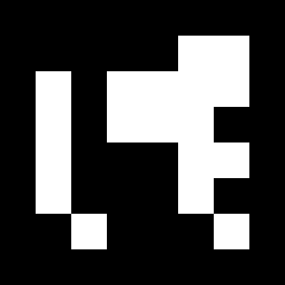
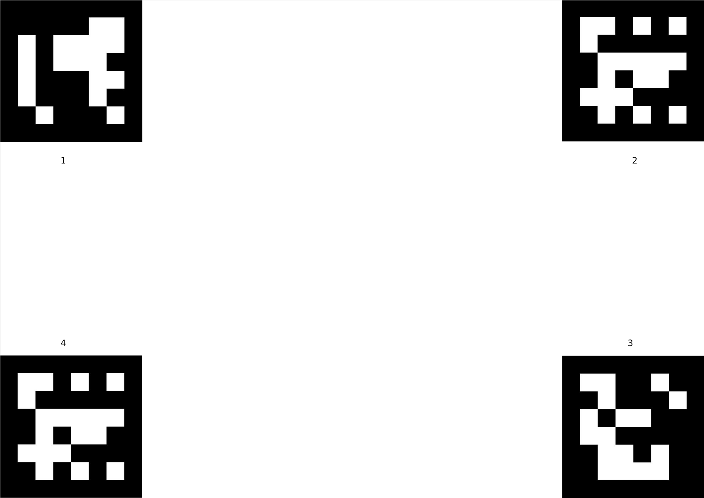
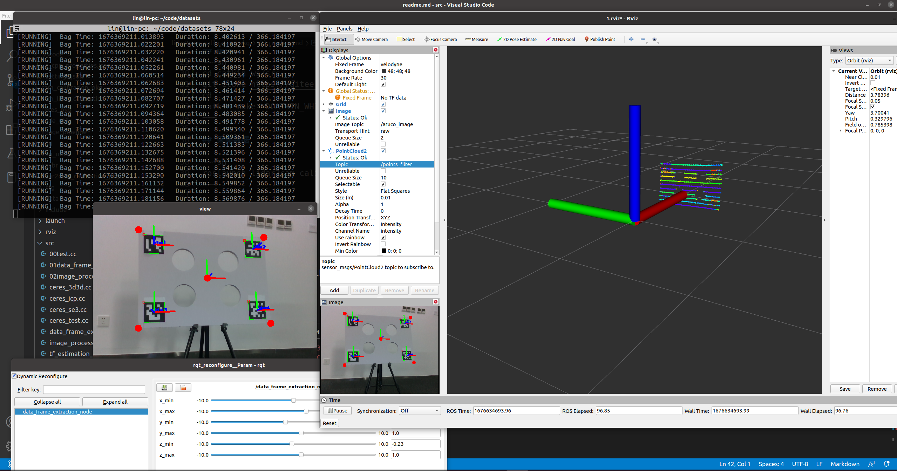

# lidar2cam_calibration简介

[docker环境部署](https://gitee.com/linClubs/lidar2cam_calibration/blob/master/data/marker_img/docker_env.md)

**谈谈写本工程的初衷**：网上也有不少激光雷达标定代码,我也git clone了不少,并编译成功。

但是在运行时，或多或少出现了很多问题，最常见的就是提不到特征，无法进行下一步，

索性自己缕了一遍原理,然后从零手写实现了标定程序。

[视频标定效果链接](https://www.bilibili.com/video/BV1g24y1W7Td/#reply153517451632)

**总结：笨比才手撸^_^**

**默认已经完成相机内参标定**

[未完成请移步到相机标定教程](https://gitee.com/linClubs/calibration_ros/tree/ros/)

+ 标定工作分为5步骤

1. 根据标定板尺寸,得到在标定板坐标系下三维坐标p_board
2. 根据二维码信息,得到标定板的像素坐标p_uv
3. 根据相机内参、p_board,p_uv计算得到,标记点在相机坐标下的坐标p_cam
4. 根据点云直通滤波分割平面、投影平面,得到标定板的点云平面,即雷达坐标p_lidar
5. 根据p_lidar，p_cam计算得到Tcl;
6. 优化Tcl。

---

# 1 lidar2cam原理

+ 一般有利用标定板，并存在**传感器数据共视关系**, 如下图所示

  

## 1.1 点约束

$$
P_c = TclP_lidar
$$

**直接找对应点**, 标定出雷达到相机坐标系下的变换矩阵 $T_{cl}$ 

+ 常见的求 $T_{cl}$ 做法还是利用**平面约束**

## 2.2 **平面约束**

相机系 $c$ 下的平面表示：法向量和一个D表示平面， 4个量表示一个平面

$$
\pi^c=\left[\mathrm{n}^c, d\right] \in \mathbb{R}^4
$$

$c$ 系外一点 $P_c$ 到平面的距离 $d$ ：

$$
\mathrm {n}^c{^T} P_c = d 
$$

2个向量的**点乘**，(一向量为单位向量)  结果就是另一向量在该单位向量上的投影（点到面的距离）

现在将雷达系 $p$ 下的点 $P_l$ 变换到 $c$ 系下 $P_c$ 表示：

$$
\mathrm {n}^c{^T}(T_{cl}*P_l) = d 
$$

**2d和3d激光都可以用平面约束求解 $T_{cl}$**。

1. 2d激光

+ 将 $T_{cl}$ 用se3表示。6个未知量。需要6个方程求解
+ 如果取z=0， $T_{cl}$ 就能化成9个量求解, 同时 $R_{cl}$ 又是一个带约束的问题

一帧数据，可以得到2个有效约束条件（因为像素只有 $uv$ 两维）。所以解6个未知数至少需要3对数据。

2. 3d激光

点云也有平面(法向量)，相机也有平面(法向量)。就可以再够成一个约束条件， 但实际一般的做法：

**该方法求解的旋转矩阵能自然地满足旋转矩阵的性质**

${R}^{\top} {R}={I}, {det}({R})=1$ ：

求解公式如下：

$$
\begin{gather}
R_{cl}n^l = n^c  \quad \quad \quad\quad\quad\quad\quad(1) \\
n^{c\top}(R_{cl}P^l + t_{cl}) + d^c =0 \quad (2)
\end{gather}
$$

+ 先根据 $(1)$ 式求旋转 $R$ ，然后由(2)式求平移 $t$ , 简化参数估计。

当激光帧数 $N$ 大于等于 2 时, 可以求解, 如下**非线性最小二乘问题**来计算旋转矩阵:

$$
\begin{gathered}
C=\sum_{i=1}^N||n_i^c-R_{cl}n_i^l||^2
\end{gathered}
$$

化简：
$$
\begin{gather}
c=\sum_{i=1}^N(n_i^c-R_{cl}n_i^l)^\top(n_i^c-R_{cl}n_i^l) \\
=\sum_{i=1}^N(n_i^{c\top}n_i^c + n_i^{l\top}n_i^l-2n_i^{c\top}R_{cl}n_i^l)
\end{gather}
$$

因此, **最小化损失函数 C 转化成最大化**(因为是减去 $2n_i^{c\top}R_{cl}n_i^l$ ):

$$
\begin{gather}
F=\sum_{i=1}^Nn_i^{c\top}R_{cl}n_i^l \\
=Trace\left(\sum_{i=1}^NR_{cl}n_i^ln_i^{c\top}\right) = Trace(RH)
\end{gather}
$$

其中, 跟 2D 激光求解时一样, 引入一个中间矩阵:

$$\begin{gather}
{H}={\sum_{i=1}^N} {n}_i^l {n}_i^{c \top}
\end{gather}$$

为了求解过程清晰, 先不加证明地引入一个引理（后续证明）, 对于任意的正定矩阵 $\mathrm{AA}^{\top}$ 以及任意的正交矩阵 $B$, 下面的不等式成立:

$$\begin{gathered}
{{Trace}\left({A A}^{\top}\right) \geq {Trace}\left({B A A} {A}^{\top}\right)}
\end{gathered}$$

对矩阵 $H$ 进行 ${SVD}$ 分解得到

$$
{H}={U} \boldsymbol{\Lambda} {V}^{\top}
$$

即：

$$
{R_{cl}}={V} {U}^{\top}
$$

已知 ${R_{cl}}$ 求解平移向量 ${t_{cl}}$ ，这时候(2)式求解只涉及到平移 ${t_{cl}}$ ，是个线性最小二乘问题 $A{t_{cl}} = b$ 
 

---

# 2 准备工作

## 2.1 code env
**opencv-4.2(3.4.16也行),pcl-10.0, noetic,ceres1.14.0**

+ noetic安装后自带opencv-4.2 与pcl-1.10,
+ 装好**ros-noetic-desktop-full**后只需单独安装**ceres-1.14.0**
+ 本代码只在ros-noetic版本编译运行,直接用ros自带的opencv-4.2 与pcl-1.10版本,建议直接抄作业
+ ceres1.14.0优化库需要安装一下

+ ros功能包依赖,编译时缺啥装啥请自行安装
~~~sh
cv_bridge dynamic_reconfigure message_filters pcl_conversions pcl_ros roscpp rospy sensor_msgs
~~~

## 2.2 标定板制作

1. 代码生成4张aruco二维码
~~~sh
roslanuch lidar2cam_calibration create_aruco_node.launch
~~~

2. 直接网站生成[生成标定板网站](https://chev.me/arucogen/)

Dictionary: 6*6

Marker ID: 1，2，3，4 不要0

Marker size, mm: 100,边长可以不管,打印出来可能会变，直接改cfg/params.yaml中参数就行

3. 打印二维码

使用代码生成的aruco二维码可以放到office-word中,修改图像的尺寸,打印出来是1：1尺寸

生成4张aruco二维码,id分别为1，2，3，4，显示id=1的二维码：

4. 制作标定板

找个矩形的木板,依次贴上4张二维码,并记录二维码在木板上位置信息

位置信息在确定相机坐标系下坐标时需要用到,需要写入`params.yaml`中

---

# 3 标定

1. 编译

+ 装好**ros-noetic-desktop-full**与**ceres-1.14.0**后编译

~~~sh
cd catkin_ws/src
git clone https://gitee.com/linClubs/lidar2cam_calibration.git
cd ..
catkin_make -DCATKIN_WHITELIST_PACKAGES="lidar2cam_calibration"
~~~

2. 修改配置文件

修改`cfg/params.yaml`的参数,基本都有注释

+ 主要修改ArUco marker:相关的参数

3. 采集数据

~~~sh
roslaunch lidar2cam_calibration data_frame_extraction_node.launch
~~~

启动后,在rqt_reconfigure窗口下，调整x,y,z点云直通滤波的值

当激光点云只剩标定板时,移动鼠标到图像view窗口,按s键进行数据采集

尽可能多的采集数据,调整标定板位置,继续采集,建议采集10组以上不同的位姿的数据。

4. 求解Tcl
~~~sh
roslaunch lidar2cam_calibration estimation_tf_node.launch
~~~

---

# 4 docker脚本自动构建环境

+ 保证自己docker已经安装好了

1. 构建docker镜像

~~~python
./docker_build.sh
~~~

2. 宿主机可视化
~~~python
sudo apt-get --no-install-recommends install -y x11-xserver-utils
xhost +
~~~

3. 启动docker容器
~~~python
docker run -it -v /tmp/.X11-unix:/tmp/.X11-unix --env="DISPLAY=$DISPLAY" --network host --name=lidar2cam ros:1.0 /bin/bash 
~~~

4. 编译代码
~~~python
cd /catkin_ws
catkin_make
source devel/setup.bash
~~~

5. 启动采集数据程序
~~~python
roslaunch lidar2cam_calibration data_frame_extraction_node.launch
~~~

6. 估计外参程序
~~~python
roslaunch lidar2cam_calibration estimation_tf_node.launch
~~~

---

